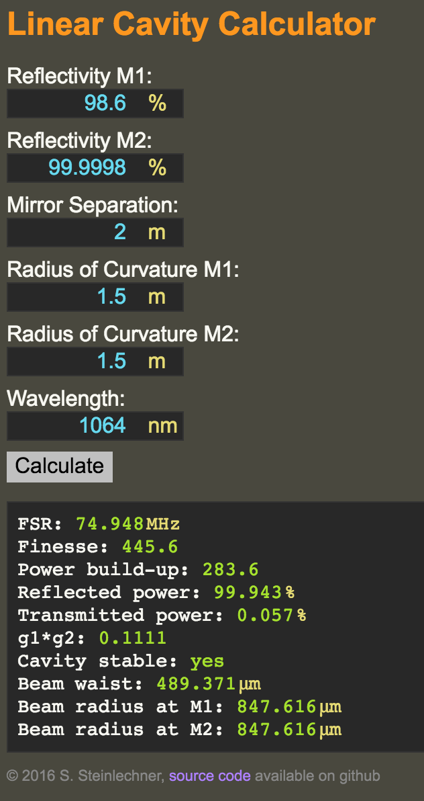

# jsCav - a linear cavity calculator

jsCav is a simple calculator for linear optical cavities written in javascript,
which allows it to run in any modern web browser (also on mobile devices!).
Here's what it looks like and what it can calculate for you:

You can run it [directly from github](http://sestei.github.com/jscav)!

Alternatively, you can simply copy all files to a directory of your choice and
then open the `index.html` in your favourite web browser (needs to be some
recent version of Chrome/Safari/Opera/Firefox/...).

## License

This work is licensed under the Creative Commons Attribution-NonCommercial-
ShareAlike 4.0 International License. To view a copy of this license, visit
http://creativecommons.org/licenses/by-nc-sa/4.0/ or send a letter to Creative
Commons, PO Box 1866, Mountain View, CA 94042, USA.

----
2016, S. Steinlechner
