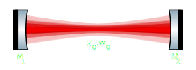
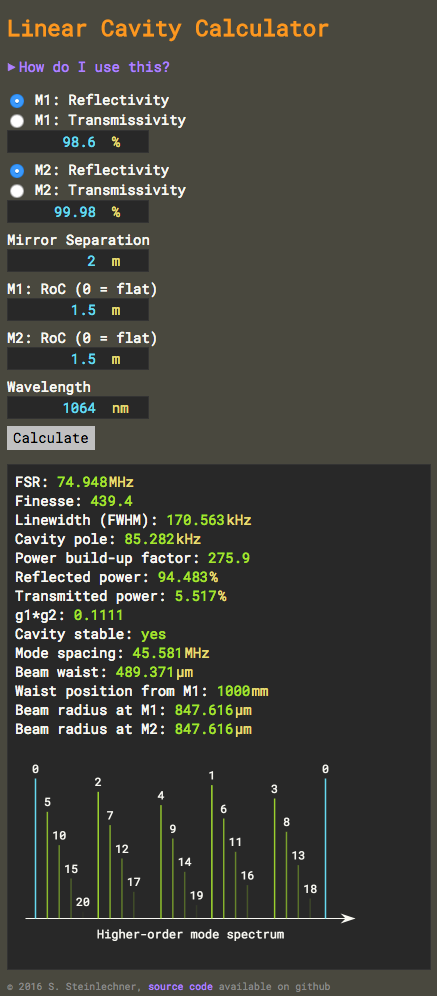

# jsCav - a linear cavity calculator

jsCav is a simple calculator for linear optical cavities written in javascript, which allows it to run in any modern web browser (also on mobile devices!).

You can run it [directly from github](http://sestei.github.com/jscav)!

## What does this calculate?

This is a simple calculator for linear optical resonators (cavities), i.e. for an optical system that looks like this:

If this doesn't look familiar to you, you probably won't need this calculator.
You will need to provide some basic optical and geometric properties of the cavity:

* _Power reflectivity_ (or transmission) of the two mirrors,
* _Radii of curvature_ (RoC) of the mirrors,
* The _separation_ between the two mirrors (assumed to be air, with index of refraction = 1),
* The operating _wavelength_.

From these inputs, the calculator will do some heavy thinking and then come up with these results:

* the _FSR_ (free spectral range), i.e. the frequency separation between two successive cavity resonances,
* the _finesse_ and the spectral _linewidth_ of each resonance, given as FWHM (full width at half maximum) and cavity pole (half width at half maximum),
* the _power-buildup_ inside the cavity,
* the _transmitted_ and _reflected_ power on resonance, in percent of the incident power,
* the cavity _g-factor product_, this product must be between 0 and 1 for a stable cavity, i.e. a cavity that supports a TEM00 fundamental mode.

The above results are always calculated, even if the cavity is unstable. This is done for convenience: one can quickly play around with e.g. the mirror reflectivities to find a suitable finesse value, without caring about suitable RoCs. Of course, to also see those values in an experiment one would first of all have to make the cavity stable.

For a stable cavity, the following additional parameters will be calculated:

* the _mode spacing_ (in frequency space) between successive higher-order mode orders, e.g. how far the TEM01 is separated from the TEM00 mode,
* the _beam waist_, the 1/e2 radius of the fundamental mode at its smallest point,
* the _waist position_, relative to mirror M1, where positive values are towards M2,
* the _spot sizes_ (1/e2 radius) of the fundamental mode on the two mirrors,
* a _mode spectrum_ showing the _resonance locations_ of the first 20 higher-order modes; this can be used to quickly check for mode degeneracy, i.e. when two modes of different mode order coincide&dagger;.

Note that the calculation assumes that all modes of Nth order (TEMmn where m+n=N) are degenerate. This is usually a good approximation as long as there is rotational symmetry within the cavity, e.g. the mirrors are non-astigmatic.

## How does it look like?

Like this:

## What do I need to run it?

Just a recent version of one of the standard web browsers (Chrome, Safari, Firefox, Edge, Opera, etc.), with JavaScript enabled. It should even run fine on your mobile phone! To keep things simple (for me, mostly...), I used some code techniques that were introduced only recently (as of 2016), so if you're stuck with an older web browser for some reason, it's highly likely that this calculator won't work for you, sorry.

You can run the calculator [directly from github](http://sestei.github.com/jscav). As the calculation runs entirely within the web browser on your computer, an active internet connection should not be necessary after you have loaded the page. Alternatively, you can simply copy all files to a directory of your choice and
then open the `index.html` in your favourite web browser.

## License

This work is licensed under the Creative Commons Attribution-NonCommercial-ShareAlike 4.0 International License. To view a copy of this license, visit http://creativecommons.org/licenses/by-nc-sa/4.0/ or send a letter to Creative Commons, PO Box 1866, Mountain View, CA 94042, USA.

----
&dagger; The height and intensity of the lines just serve to visually distinguish them and should not be mistaken for a representation of the actual mode content.

----
2016, S. Steinlechner
